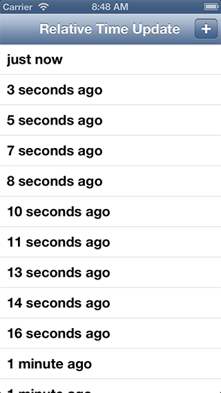

# Relative Time Update
Simple project showing how to implement auto-updating relative date we can see in many apps.  
It uses @mattt's great [FormatterKit](https://github.com/mattt/FormatterKit) for time interval formatting.

## Preview

## Contact

Ali Karagoz

- http://github.com/alikaragoz
- http://twitter.com/alikaragoz
